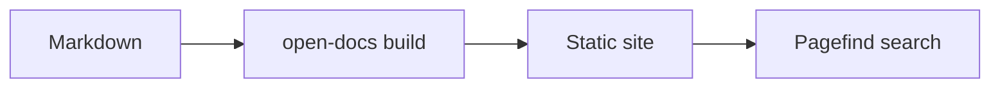
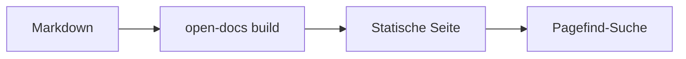

# Code & Diagramme

## Code-Blöcke

Code-Blöcke werden mit [Shiki](https://shiki.style) syntaxhervorgehoben,
über ein doppeltes Hell-/Dunkel-Theme, das dem Farbmodus der Seite folgt.
Beim Überfahren eines Blocks erscheint ein **Kopieren**-Button.

Geben Sie die Sprache im Info-String des Code-Blocks an:

````markdown
```ts
export function greet(name: string): string {
  return `Hello, ${name}!`;
}
```
````

… wird so dargestellt:

```ts
export function greet(name: string): string {
  return `Hello, ${name}!`;
}
```

Die Hervorhebung läuft nach dem Laden im Browser, daher kann ein Block beim
ersten Paint kurz ohne Stil aufblitzen. Für eine Doku ist das vertretbar und
hält den Highlighter aus dem initialen Bundle heraus.

## Dateinamen

Umschließen Sie einen Code-Block mit ``, um ihm eine
Dateinamen-Kopfzeile zu geben:


```ts
export const greet = (name: string) => `Hello, ${name}!`;
```


````markdown

```ts
export const greet = (name) => `Hello, ${name}!`;
```

````

## Hervorhebung & Diffs

Markieren Sie Zeilen, indem Sie einen Kommentar in den Code einfügen. Der
Marker-Kommentar wird aus der gerenderten Ausgabe entfernt:

- `// [!code highlight]`: die Zeile einfärben
- `// [!code ++]`: als hinzugefügt markieren — grün, mit einem `+` am Rand
- `// [!code --]`: als entfernt markieren — rot, mit einem `-` am Rand

Dieser Quelltext wird also mit angewendeten und entfernten Markern gerendert:

```ts
const config = loadConfig();
const timeout = 30; // [!code --]
const timeout = 60; // [!code ++]
start(config); // [!code highlight]
```

Dieselben Marker funktionieren in jeder Sprache; die Kommentarsyntax richtet
sich nach der Sprache des Code-Blocks.

## Mermaid-Diagramme

Ein mit `mermaid` ausgezeichneter Code-Block wird als Diagramm statt als Code
gerendert. Das Diagramm übernimmt die Theme-Farben der Seite und bleibt so im
Hell- wie im Dunkelmodus lesbar. Ein Klick auf ein Diagramm vergrößert es in
einem Dialog, was bei detaillierteren Diagrammen hilft.

````markdown

````

… wird so dargestellt:




Die Mermaid-Engine (~500 KB) wird nur auf Seiten geladen, die tatsächlich ein
Diagramm enthalten, sodass reine Textseiten leichtgewichtig bleiben.

