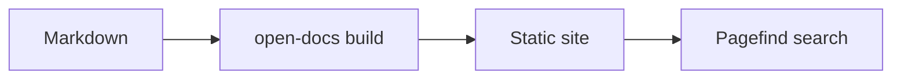

# Code & diagrams

## Fenced code

Fenced code blocks are syntax-highlighted with
[Shiki](https://shiki.style) using a dual light/dark theme that follows
the site's color mode. Hovering a block reveals a **copy** button.

Set the language on the fence's info string:

````markdown
```ts
export function greet(name: string): string {
  return `Hello, ${name}!`;
}
```
````

…renders as:

```ts
export function greet(name: string): string {
  return `Hello, ${name}!`;
}
```

Highlighting runs in the browser after load, so the first paint of a
block may flash unstyled briefly — acceptable for docs, and it keeps
the highlighter out of the initial bundle.

## Filenames

Wrap a fence in `` to give it a filename header:


```ts
export const greet = (name: string) => `Hello, ${name}!`;
```


````markdown

```ts
export const greet = (name) => `Hello, ${name}!`;
```

````

## Highlighting & diffs

Mark lines by adding a comment **inside** the code — the marker comment
is stripped from the rendered output:

- `// [!code highlight]` — tint the line
- `// [!code ++]` — mark it as added (green)
- `// [!code --]` — mark it as removed (red)

So this source renders with the markers applied and removed:

```ts
const config = loadConfig();
const timeout = 30; // [!code --]
const timeout = 60; // [!code ++]
start(config); // [!code highlight]
```

The same markers work in any language; the comment syntax follows the
fence's language.

## Mermaid diagrams

A fence tagged `mermaid` is rendered as a diagram instead of code. The
diagram picks up the site's theme colors, so it stays legible in both
light and dark mode.

````markdown

````

…renders as:



The Mermaid engine (~500 KB) is only fetched on pages that actually
contain a diagram, so prose-only pages stay light.

