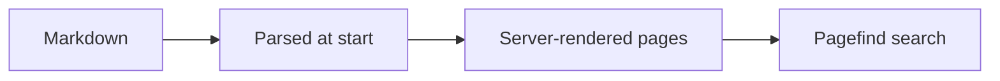

# Código y diagramas

## Bloques de código

Los bloques de código tienen resaltado de sintaxis con
[Shiki](https://shiki.style) mediante un tema dual claro/oscuro que sigue el
modo de color del sitio. Al pasar el ratón por encima de un bloque aparece un
botón de **copiar**.

Indica el lenguaje en la cadena de información de la valla:

````markdown
```ts
export function greet(name: string): string {
  return `Hello, ${name}!`;
}
```
````

…se renderiza como:

```ts
export function greet(name: string): string {
  return `Hello, ${name}!`;
}
```

El resaltado se ejecuta en el navegador después de cargar, así que el primer
pintado de un bloque puede mostrarse sin estilos durante un instante. Es
aceptable para documentación y mantiene el resaltador fuera del paquete
inicial.

## Nombres de archivo

Envuelve una valla en `` para darle una cabecera con el nombre del
archivo:


```ts
export const greet = (name: string) => `Hello, ${name}!`;
```


````markdown

```ts
export const greet = (name) => `Hello, ${name}!`;
```

````

## Resaltado y diffs

Marca líneas añadiendo un comentario dentro del código. El comentario marcador
se elimina de la salida renderizada:

- `// [!code highlight]`: tiñe la línea
- `// [!code ++]`: la marca como añadida — en verde, con un `+` en el margen
- `// [!code --]`: la marca como eliminada — en rojo, con un `-` en el margen

Así que este código fuente se renderiza con los marcadores aplicados y
eliminados:

```ts
const config = loadConfig();
const timeout = 30; // [!code --]
const timeout = 60; // [!code ++]
start(config); // [!code highlight]
```

Los mismos marcadores funcionan en cualquier lenguaje; la sintaxis del
comentario sigue el lenguaje de la valla.

## Diagramas de Mermaid

Una valla etiquetada como `mermaid` se renderiza como diagrama en lugar de
código. El diagrama adopta los colores del tema del sitio, así que se mantiene
legible tanto en modo claro como oscuro. Haz clic en un diagrama para ampliarlo
en un diálogo, lo que ayuda cuando alguno se vuelve detallado.

````markdown

````

…se renderiza como:



El motor de Mermaid (~500 KB) solo se descarga en las páginas que de verdad
contienen un diagrama, así que las páginas con solo texto se mantienen ligeras.

