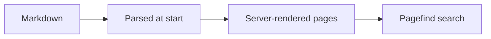

# Code et diagrammes

## Blocs de code

Les blocs de code sont colorés syntaxiquement avec
[Shiki](https://shiki.style) à l'aide d'un double thème clair/sombre qui suit
le mode de couleur du site. Survoler un bloc fait apparaître un bouton
**copier**.

Indiquez le langage dans la chaîne d'information de l'ouverture du bloc :

````markdown
```ts
export function greet(name: string): string {
  return `Hello, ${name}!`;
}
```
````

… s'affiche ainsi :

```ts
export function greet(name: string): string {
  return `Hello, ${name}!`;
}
```

La coloration s'exécute dans le navigateur après le chargement ; le premier
rendu d'un bloc peut donc apparaître brièvement sans style. C'est acceptable
pour une documentation, et cela garde le coloriseur hors du bundle initial.

## Noms de fichiers

Enveloppez un bloc dans `` pour lui ajouter un en-tête avec le nom de
fichier :


```ts
export const greet = (name: string) => `Hello, ${name}!`;
```


````markdown

```ts
export const greet = (name) => `Hello, ${name}!`;
```

````

## Surlignage et diffs

Marquez des lignes en ajoutant un commentaire dans le code. Le commentaire
marqueur est retiré du rendu :

- `// [!code highlight]` : teinte la ligne
- `// [!code ++]` : la marque comme ajoutée — en vert, avec un `+` dans la gouttière
- `// [!code --]` : la marque comme supprimée — en rouge, avec un `-` dans la gouttière

Cette source s'affiche donc avec les marqueurs ajoutés et supprimés appliqués :

```ts
const config = loadConfig();
const timeout = 30; // [!code --]
const timeout = 60; // [!code ++]
start(config); // [!code highlight]
```

Les mêmes marqueurs fonctionnent dans tous les langages ; la syntaxe du
commentaire suit le langage du bloc.

## Diagrammes Mermaid

Un bloc taggé `mermaid` est rendu sous forme de diagramme plutôt que de code.
Le diagramme reprend les couleurs du thème du site, et reste donc lisible en
mode clair comme en mode sombre. Cliquez sur un diagramme pour l'agrandir dans
une boîte de dialogue, ce qui aide quand il devient détaillé.

````markdown

````

… s'affiche ainsi :



Le moteur Mermaid (~500 Ko) n'est récupéré que sur les pages qui contiennent
réellement un diagramme, de sorte que les pages de texte seul restent légères.

