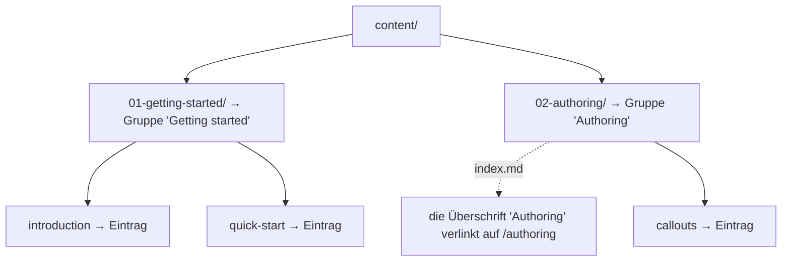

# Aus Ordnern abgeleitete Navigation

Die Seitenleiste wird aus Ihrem Inhaltsordner erzeugt. Es gibt **keine Navigationskonfigurationsdatei**, die Sie schreiben oder pflegen müssen.
Verschieben Sie eine Datei, und die Navigation zieht mit.

## Wie der Baum auf die Seitenleiste abbildet


- content/
  - 01-getting-started/
    - 01-introduction.md
    - 02-quick-start.md
  - 02-authoring/
    - index.md
    - 01-callouts.md




- **Ordner der ersten Ebene** werden zu **Gruppen** in der Seitenleiste,
  benannt nach dem Ordnernamen.
- **Dateien in einem Ordner** werden zu den **Einträgen** dieser Gruppe.
- **Dateien auf oberster Ebene** (direkt im Inhaltsverzeichnis) erscheinen
  oberhalb der Gruppen, ohne Gruppenzuordnung.
- **Die `index.md` eines Ordners** macht die Überschrift des Abschnitts zum
  Link auf dessen Seite (ausgeliefert unter der URL des Ordners). Es gibt
  keinen separaten Eintrag „Übersicht"; klicken Sie auf den Abschnittstitel,
  um ihn zu öffnen. Eine `README.md` dient als Rückgriff, wenn ein Ordner
  keine `index.md` hat.

## Verschachtelung

<!-- docref: begin src=src/lib/server/content-store.ts#MAX_SECTION_DEPTH:ed5a3edd -->

Ordner lassen sich verschachteln, und die Seitenleiste tut das ebenfalls, bis
zu drei Ebenen tief (Ebene 1 ist ein Ordner auf oberster Ebene, Ebene 3 ein
Ordner drei Stufen tiefer):


- content/
  - reference/ — Ebene 1, Abschnittsüberschrift
    - api/ — Ebene 2, einklappbarer Unterabschnitt
      - auth.md
      - webhooks/ — Ebene 3, einklappbarer Unterabschnitt
        - events.md


Ebene 2 und 3 werden als einklappbare Unterabschnitte dargestellt; der Zweig
mit der Seite, auf der Sie sich gerade befinden, öffnet sich automatisch.
Alles, was tiefer als drei Ebenen verschachtelt ist, wird in den Abschnitt der
dritten Ebene zusammengeführt. Die Seite behält ihre vollständige URL, und die
Seitenleiste rückt nicht weiter ein.

<!-- docref: end -->


Jede Gruppe in dieser Seitenleiste ist ein Ordner auf oberster Ebene. Fügen
Sie einen Unterordner hinzu, und er wird zum einklappbaren Unterabschnitt
unter seinem übergeordneten Ordner.


## Titel

<!-- docref: begin src=src/lib/slug.ts#titleFromSegment:d11d1ecd -->

Standardmäßig wird ein Titel aus dem Dateinamen abgeleitet: `quick-start.md`
wird zu „Quick start". Überschreiben Sie ihn pro Seite über das Frontmatter.
Siehe [Reihenfolge & Titel](/de/navigation/ordering-and-titles).

<!-- docref: end -->

## Die Startseite

Der Wurzelpfad der Website (`/`) ist ein generierter Hero, der Ihre Abschnitte
als Karten auflistet; er ist keine Inhaltsdatei. Beginnen Sie Ihre erste
Gruppe mit einer Einführungsseite, so wie diese Doku mit der
[Einführung](/de/getting-started/introduction) öffnet.

### Abschnitts-Icons

Jede Karte zeigt ein Standard-Glyph, sofern die `index.md` des Abschnitts
nicht ein `icon:` im Frontmatter setzt. Es bleibt auf dieser einen Seite, ohne
separaten Asset-Ordner, und akzeptiert drei Formen:

```markdown
---
icon: "🚀"                              # an emoji
# icon: '<svg viewBox="0 0 24 24">…</svg>'   # inline SVG (one line)
# icon: /icons/rocket.svg               # a file under static/
---
```

Die Karten auf der Startseite dieser Website werden alle auf diese Weise
gesteuert: jeder Abschnitt auf oberster Ebene setzt hier ein Emoji-Icon in
seiner `index.md`.


Interne Links werden beim Start der Website geprüft. Ein toter interner Link
stoppt den Container mit einer Fehlermeldung, die Datei und Zeile nennt,
sodass ein veralteter Link nie als kaputte Seite in die Produktion gelangt.

