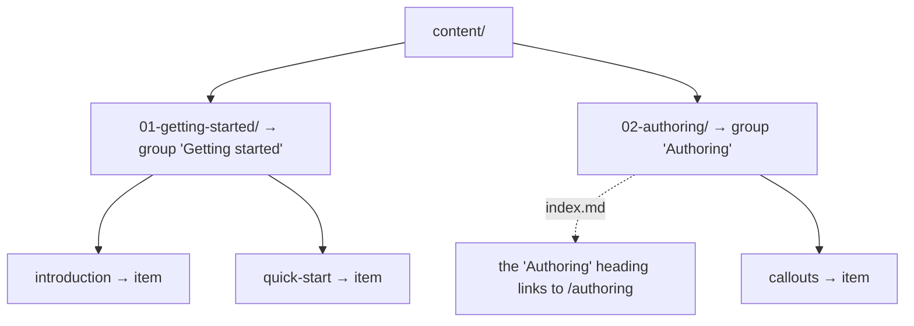

# Navegación derivada de carpetas

La barra lateral se construye a partir de tu carpeta de contenido. **No hay ningún archivo de configuración de navegación** que escribir ni
mantener sincronizado. Mueve un archivo y la navegación lo sigue.

## Cómo se traduce el árbol a la barra lateral


- content/
  - 01-getting-started/
    - 01-introduction.md
    - 02-quick-start.md
  - 02-authoring/
    - index.md
    - 01-callouts.md




- Las **carpetas de primer nivel** se convierten en **grupos** de la
  barra lateral, con el nombre de la carpeta como título.
- Los **archivos de una carpeta** se convierten en los **elementos** de
  ese grupo.
- Los **archivos de nivel superior** (directamente en la raíz del
  contenido) aparecen sobre los grupos, sin agrupar.
- El **`index.md` de una carpeta** hace que el encabezado de esa sección
  sea el enlace a su página (servida en la URL de la carpeta). No hay una
  entrada "Resumen" aparte; haz clic en el título de la sección para
  abrirla. Un `README.md` sirve de respaldo cuando una carpeta no tiene
  `index.md`.

## Anidamiento

Las carpetas pueden anidarse, y la barra lateral también, hasta tres
niveles de profundidad (el nivel 1 es una carpeta de nivel superior, el
nivel 3 es una carpeta a tres de profundidad):


- content/
  - reference/ — nivel 1, encabezado de sección
    - api/ — nivel 2, subsección plegable
      - auth.md
      - webhooks/ — nivel 3, subsección plegable
        - events.md


Los niveles 2 y 3 se muestran como subsecciones plegables; la rama que
contiene la página en la que estás se abre automáticamente. Todo lo que
quede anidado más allá de tres niveles se aplana dentro de la sección de
tercer nivel. La página conserva su URL completa y la barra lateral deja
de sangrar.


Cada grupo de esta barra lateral es una carpeta de nivel superior. Añade
una subcarpeta y se convierte en una subsección plegable bajo su carpeta
padre.


## Títulos

Por defecto, el título se deriva del nombre del archivo: `quick-start.md`
se convierte en "Quick start". Puedes anularlo en cada página con el
frontmatter. Consulta [Orden y títulos](/es/navigation/ordering-and-titles).

## La página de inicio

La raíz del sitio (`/`) es un hero generado que lista tus secciones como
tarjetas; no es un archivo de contenido. Empieza tu primer grupo con una
página de introducción, igual que estos docs abren con
[Introducción](/es/getting-started/introduction).

### Iconos de sección

Cada tarjeta muestra un glifo por defecto, salvo que el `index.md` de la
sección defina un `icon:` en su frontmatter. Se queda en esa única
página, sin carpeta de recursos aparte, y acepta tres formas:

```markdown
---
icon: "🚀"                              # an emoji
# icon: '<svg viewBox="0 0 24 24">…</svg>'   # inline SVG (one line)
# icon: /icons/rocket.svg               # a file under static/
---
```

Las tarjetas de la página de inicio de este sitio funcionan todas así:
cada sección de nivel superior define aquí un icono emoji en su
`index.md`.


Los enlaces internos se validan cuando el sitio arranca. Un enlace
interno muerto detiene el contenedor con un error que indica el archivo
y la línea, así que un enlace obsoleto nunca llega a producción como
una página rota.

