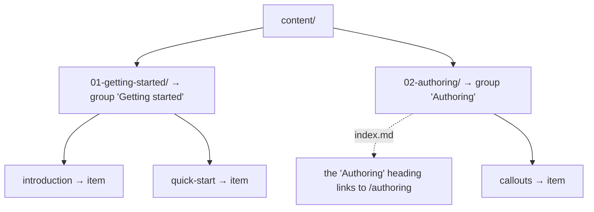

# Navigation dérivée des dossiers

La barre latérale est construite à partir de votre dossier de contenu.
Il n'y a **aucun fichier de configuration de navigation** à écrire ni à
maintenir à jour. Déplacez un fichier, et la navigation suit.

## Comment l'arborescence se traduit dans la barre latérale


- content/
  - 01-getting-started/
    - 01-introduction.md
    - 02-quick-start.md
  - 02-authoring/
    - index.md
    - 01-callouts.md




- **Les dossiers de premier niveau** deviennent des **groupes** dans la
  barre latérale, dont le titre reprend le nom du dossier.
- **Les fichiers d'un dossier** deviennent les **éléments** de ce groupe.
- **Les fichiers de premier niveau** (directement à la racine du contenu)
  apparaissent au-dessus des groupes, sans regroupement.
- **Le fichier `index.md` d'un dossier** transforme le titre de la section
  en lien vers sa page (servie à l'URL du dossier). Il n'y a pas d'entrée
  « Aperçu » distincte ; cliquez sur le titre de la section pour l'ouvrir.

## Imbrication

Les dossiers peuvent s'imbriquer, et la barre latérale aussi, jusqu'à
trois niveaux de profondeur (le niveau 1 est un dossier de premier niveau,
le niveau 3 un dossier à trois niveaux de profondeur) :


- content/
  - reference/ — niveau 1, titre de section
    - api/ — niveau 2, sous-section repliable
      - auth.md
      - webhooks/ — niveau 3, sous-section repliable
        - events.md


Les niveaux 2 et 3 s'affichent comme des sous-sections repliables ; la
branche contenant la page en cours s'ouvre automatiquement. Tout ce qui
est imbriqué au-delà de trois niveaux est aplati dans la section de
troisième niveau. La page conserve son URL complète, et la barre latérale
cesse d'indenter.


Chaque groupe de cette barre latérale est un dossier de premier niveau.
Ajoutez un sous-dossier et il devient une sous-section repliable sous son
parent.


## Titres

Par défaut, un titre est dérivé du nom de fichier : `quick-start.md`
devient « Quick start ». Vous pouvez le remplacer page par page via le
frontmatter. Voir
[Ordre et titres](/fr/navigation/ordering-and-titles).

## La page d'accueil

La racine du site (`/`) est un hero généré qui présente vos sections sous
forme de cartes ; ce n'est pas un fichier de contenu. Faites commencer
votre premier groupe par une page d'introduction, comme ces docs s'ouvrent
sur [Introduction](/fr/getting-started/introduction).

### Icônes de section

Chaque carte affiche un glyphe par défaut, à moins que le fichier
`index.md` de la section ne définisse une clé `icon:` dans son frontmatter.
Elle reste sur cette unique page, sans dossier d'assets distinct, et
accepte trois formes :

```markdown
---
icon: "🚀"                              # an emoji
# icon: '<svg viewBox="0 0 24 24">…</svg>'   # inline SVG (one line)
# icon: /icons/rocket.svg               # a file under static/
---
```

Les cartes de la page d'accueil de ce site fonctionnent toutes ainsi :
chaque section de premier niveau y définit une icône emoji dans son
`index.md`.


Les liens sont validés par rapport au système de fichiers lors de la
construction du site ; un lien périmé se manifeste donc par un 404 clair
pendant la construction plutôt que par une page cassée en production.

