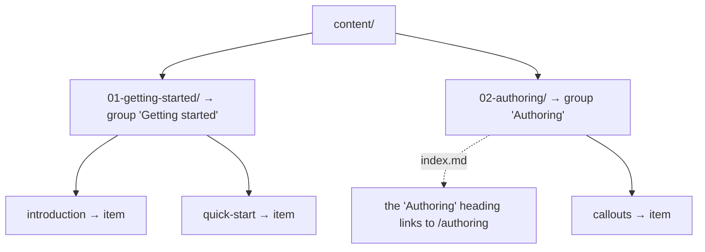

# Folder-derived navigation

The sidebar is built from your content folder. There is **no nav config file** to write or keep in sync. Move a file, and the navigation
follows.

## How the tree maps to the sidebar


- content/
  - 01-getting-started/
    - 01-introduction.md
    - 02-quick-start.md
  - 02-authoring/
    - index.md
    - 01-callouts.md




- **First-level folders** become sidebar **groups**, titled after the
  folder name.
- **Files in a folder** become that group's **items**.
- **Top-level files** (directly in the content root) appear above the
  groups, ungrouped.
- **A folder's `index.md`** makes that section's heading the link to its
  page (served at the folder's URL). There's no separate "Overview"
  entry; click the section title to open it. A `README.md` serves as
  the fallback when a folder has no `index.md`.

## Nesting

Folders can nest, and so does the sidebar, up to three levels deep
(level 1 is a top-level folder, level 3 is a folder three deep):


- content/
  - reference/ — level 1, section heading
    - api/ — level 2, collapsible sub-section
      - auth.md
      - webhooks/ — level 3, collapsible sub-section
        - events.md


<!-- docref: begin src=src/lib/server/content-store.ts#MAX_SECTION_DEPTH:ed5a3edd -->
Levels 2 and 3 render as collapsible sub-sections; the branch
containing the page you're on opens automatically. Anything nested
deeper than three levels flattens into the third-level section. The
page keeps its full URL, and the sidebar stops indenting.
<!-- docref: end -->


Every group in this sidebar is a top-level folder. Add a subfolder and
it becomes a collapsible sub-section beneath its parent.


## Titles

<!-- docref: begin src=src/lib/slug.ts#titleFromSegment:d11d1ecd -->
By default a title is derived from the filename: `quick-start.md`
becomes "Quick start". Override it per page with frontmatter. See
[Ordering & titles](/navigation/ordering-and-titles).
<!-- docref: end -->

## The home page

The site root (`/`) is a generated hero listing your sections as cards;
it is not a content file. Lead your first group with an introduction
page, the way these docs open with
[Introduction](/getting-started/introduction).

### Section icons

Each card shows a default glyph unless the section's `index.md` sets an
`icon:` in its frontmatter. It stays on that one page, with no separate
asset folder, and accepts three forms:

```markdown
---
icon: "🚀"                              # an emoji
# icon: '<svg viewBox="0 0 24 24">…</svg>'   # inline SVG (one line)
# icon: /icons/rocket.svg               # a file under static/
---
```

The cards on this site's home page are all driven this way: every
top-level section here sets an emoji icon in its `index.md`.


Internal links are validated when the site starts. A dead internal
link stops the container with an error naming the file and line, so a
stale link never reaches production as a broken page.

