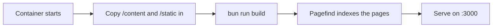

# Deployment mit Docker

Der empfohlene Weg, open-docs zu betreiben, ist der veröffentlichte
Container. Ein generisches Image bedient jede Doku; den Inhalt liefern
Sie zur Laufzeit.

```sh
docker run --rm -p 3000:3000 \
  -v ./content:/content:ro \
  -v ./static:/static:ro \
  -e PUBLIC_BRAND_NAME="My Project" \
  -e PUBLIC_SITE_TITLE="My Project Docs" \
  -e PUBLIC_REPO_URL="https://github.com/me/my-project" \
  ghcr.io/manchtools/open-docs:latest
```

Rufen Sie `http://localhost:3000` auf.

## Mounts

| Mount | Verweist auf | Enthält |
|---|---|---|
| `/content` | `src/content/` | Ihre `.md`-/`.markdoc`-Dateien und optional `theme.css`. |
| `/static` | `static/` | Favicons, `og.png`, Screenshots. Werden über die Standarddateien gelegt. |

Beide Mounts sind optional. Der Content-Mount kann nur lesend sein
(`:ro`); der Entrypoint kopiert ihn vor dem Build in den Image-Baum.


Ohne `/content`-Mount bedient das Image die open-docs-Dokumentation
selbst, eine Live-Demo, die Sie durchklicken können, bevor Sie eigene
Inhalte hinzufügen.


## Wie ein Build abläuft

Das Image verschiebt den Site-Build auf den Containerstart, damit
dasselbe veröffentlichte Image für beliebige Inhalte funktioniert:



Das bedeutet einen kurzen Build beim Start, dafür gibt es ein einziges
generisches, kleines Image statt eines separaten Images pro Doku.

## Deployments unter einem Unterpfad

Um unter einem Unterpfad zu hosten (zum Beispiel
`https://example.com/docs`), setzen Sie `BASE_PATH`:

```sh
-e BASE_PATH=/docs
```

Alle internen Links, Assets und der Suchindex werden mit diesem Präfix
erzeugt.

## Umgebung

Jede `PUBLIC_*`-Variable wird in den Build eingebacken. Siehe
[Konfiguration](/de/customizing/configuration) für das Site-Chrome und
[Umgebungsvariablen](/de/reference/environment-variables) für die
vollständige Liste.
