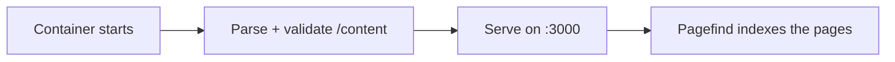

# Deployment mit Docker

Der empfohlene Weg, open-docs zu betreiben, ist der veröffentlichte
Container. Ein generisches Image bedient jede Doku; den Inhalt liefern
Sie zur Laufzeit.

```sh
docker run --rm -p 3000:3000 \
  -v ./content:/content:ro \
  -v ./static:/static:ro \
  -e PUBLIC_SITE_URL="https://docs.example.com" \
  -e PUBLIC_BRAND_NAME="My Project" \
  -e PUBLIC_SITE_TITLE="My Project Docs" \
  -e PUBLIC_REPO_URL="https://github.com/me/my-project" \
  ghcr.io/manchtools/open-docs:latest
```

Rufen Sie `http://localhost:3000` auf.


`PUBLIC_SITE_URL` ist die vollständige öffentliche Basis-URL Ihrer Website
(z. B. `https://docs.example.com`). Setzen Sie sie bei **jedem**
Deployment. Ohne sie greifen kanonische Links, `sitemap.xml`,
`robots.txt`, `llms.txt` und die **Atom-Feeds** des Blogs auf relative
URLs zurück — Suchmaschinen und Feed-Importer (dev.to, Medium) können
Ihre Seiten dann nicht auflösen, und der Server gibt beim Start eine
Warnung aus. Es kostet nichts und löst keinen Rebuild aus, es gibt also
keinen Grund, sie wegzulassen.


## Docker Compose

Dieselbe Konfiguration als `compose.yaml`. Halten Sie `PUBLIC_SITE_URL`
oben in `environment:`, damit sie nie vergessen wird:

```yaml
services:
  docs:
    image: ghcr.io/manchtools/open-docs:latest
    ports:
      - "3000:3000"
    environment:
      # ERFORDERLICH in Produktion — die vollständige öffentliche Basis-URL.
      # Aktiviert absolute kanonische Links, sitemap.xml, robots.txt,
      # llms.txt und syndizierungsfähige Atom-Feeds. Ohne sie bleiben all
      # diese relativ (der Server warnt beim Start).
      PUBLIC_SITE_URL: "https://docs.example.com"
      PUBLIC_BRAND_NAME: "My Project"
      PUBLIC_SITE_TITLE: "My Project Docs"
      PUBLIC_REPO_URL: "https://github.com/me/my-project"
    volumes:
      - ./content:/content:ro
      - ./static:/static:ro
    restart: unless-stopped
```

Starten Sie es mit `docker compose up -d`.

## Mounts

| Mount | Verweist auf | Enthält |
|---|---|---|
| `/content` | `src/content/` | Ihre `.md`-/`.markdoc`-Dateien und optional `theme.css`. |
| `/static` | `static/` | Favicons, `og.png`, Screenshots. Werden über die Standarddateien gelegt. |

Beide Mounts sind optional. Der Content-Mount kann nur lesend sein
(`:ro`); der Entrypoint kopiert ihn in den Image-Baum, bevor der Server
startet.


Ohne `/content`-Mount bedient das Image die open-docs-Dokumentation
selbst, eine Live-Demo, die Sie durchklicken können, bevor Sie eigene
Inhalte hinzufügen.


## Was beim Start passiert

Es gibt keinen Build-Schritt. Der Container parst und validiert Ihr
Markdown beim Start (ein paar Sekunden, rund 100–150 MB Speicher – er
läuft problemlos auf einem 256-MB-Host) und rendert die Seiten auf dem
Server. Der Suchindex wird wenige Augenblicke nach dem Hochfahren des
Servers erzeugt:



Die Validierung ist strikt: ein unbekannter Tag, ein fehlendes
Pflichtattribut, ein toter interner Link oder ein Screenshot, der auf eine
fehlende Datei zeigt, stoppt den Container mit einer Auflistung von Datei
und Zeile – genauso, wie früher der Build fehlgeschlagen wäre. Korrigieren
Sie den Inhalt und starten Sie ihn erneut.

Da nichts kompiliert wird, genügt für Änderungen an Inhalt, Branding
(`PUBLIC_*`), Tokens oder `theme.css` ein Neustart des Containers.

## Deployments unter einem Unterpfad

Um unter einem Unterpfad zu hosten (zum Beispiel
`https://example.com/docs`), setzen Sie `BASE_PATH`:

```sh
-e BASE_PATH=/docs
```

Alle internen Links, Assets und der Suchindex werden unter diesem Präfix
ausgeliefert. Dies ist die einzige Einstellung, die die App beim Start noch
neu baut (SvelteKit kompiliert den Basispfad fest ein), was etwa 1,5 GB
Speicher benötigt – auf kleinen Hosts entfernen Sie das Präfix stattdessen
besser am Reverse-Proxy.

## Umgebung

Jede `PUBLIC_*`-Variable wird beim Start des Containers gelesen. Siehe
[Konfiguration](/de/customizing/configuration) für das Site-Chrome und
[Umgebungsvariablen](/de/reference/environment-variables) für die
vollständige Liste.
