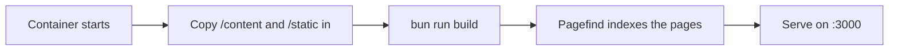

# Despliegue con Docker

La forma recomendada de ejecutar open-docs es el contenedor publicado. Una
única imagen genérica sirve cualquier conjunto de documentos; el contenido se
proporciona en tiempo de ejecución.

```sh
docker run --rm -p 3000:3000 \
  -v ./content:/content:ro \
  -v ./static:/static:ro \
  -e PUBLIC_BRAND_NAME="My Project" \
  -e PUBLIC_SITE_TITLE="My Project Docs" \
  -e PUBLIC_REPO_URL="https://github.com/me/my-project" \
  ghcr.io/manchtools/open-docs:latest
```

Abre `http://localhost:3000`.

## Montajes

| Montaje | Apunta a | Contiene |
|---|---|---|
| `/content` | `src/content/` | Tus archivos `.md` / `.markdoc` y, opcionalmente, `theme.css`. |
| `/static` | `static/` | Favicons, `og.png`, capturas de pantalla. Se fusionan sobre los valores por defecto. |

Ambos montajes son opcionales. El montaje de contenido puede ser de solo
lectura (`:ro`); el entrypoint lo copia al árbol de la imagen antes de compilar.


Sin un montaje en `/content`, la imagen sirve la propia documentación de
open-docs, una demo en vivo que puedes recorrer antes de añadir tu propio
contenido.


## Cómo se produce una compilación

La imagen pospone la compilación del sitio al arranque del contenedor, de modo
que la misma imagen publicada funciona para cualquier contenido:



Esto añade una compilación breve al arrancar, a cambio de una única imagen
publicada genérica y pequeña en lugar de una imagen distinta por cada conjunto
de documentos.

## Despliegues bajo subruta

Para alojar bajo una subruta (por ejemplo `https://example.com/docs`), define
`BASE_PATH`:

```sh
-e BASE_PATH=/docs
```

Todos los enlaces internos, los recursos y el índice de búsqueda se generan con
ese prefijo.

## Entorno

Cada variable `PUBLIC_*` se integra en la compilación. Consulta
[Configuración](/es/customizing/configuration) para los elementos del sitio y
[Variables de entorno](/es/reference/environment-variables) para la lista
completa.
