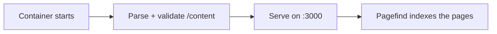

# Despliegue con Docker

La forma recomendada de ejecutar open-docs es el contenedor publicado. Una
única imagen genérica sirve cualquier conjunto de documentos; el contenido se
proporciona en tiempo de ejecución.

```sh
docker run --rm -p 3000:3000 \
  -v ./content:/content:ro \
  -v ./static:/static:ro \
  -e PUBLIC_BRAND_NAME="My Project" \
  -e PUBLIC_SITE_TITLE="My Project Docs" \
  -e PUBLIC_REPO_URL="https://github.com/me/my-project" \
  ghcr.io/manchtools/open-docs:latest
```

Abre `http://localhost:3000`.

## Montajes

| Montaje | Apunta a | Contiene |
|---|---|---|
| `/content` | `src/content/` | Tus archivos `.md` / `.markdoc` y, opcionalmente, `theme.css`. |
| `/static` | `static/` | Favicons, `og.png`, capturas de pantalla. Se fusionan sobre los valores por defecto. |

Ambos montajes son opcionales. El montaje de contenido puede ser de solo
lectura (`:ro`); el entrypoint lo copia al árbol de la imagen antes de compilar.


Sin un montaje en `/content`, la imagen sirve la propia documentación de
open-docs, una demo en vivo que puedes recorrer antes de añadir tu propio
contenido.


## Cómo se produce una compilación

No hay ningún paso de compilación. El contenedor analiza y valida el
Markdown al arrancar (un par de segundos, entre 100 y 150 MB de memoria
aproximadamente: funciona con holgura en un host de 256 MB) y renderiza
las páginas en el servidor. El índice de búsqueda se construye momentos
después de que el servidor esté en marcha:



La validación es estricta: una etiqueta desconocida, un atributo
obligatorio ausente, un enlace interno roto o una captura de pantalla que
apunte a un archivo inexistente detiene el contenedor con un listado de
archivo y línea, igual que habría fallado la antigua compilación. Corrige
el contenido y vuelve a arrancarlo.

Como nada se compila, cambiar el contenido, la marca (`PUBLIC_*`), los
tokens o `theme.css` solo requiere reiniciar el contenedor.

## Despliegues bajo subruta

Para alojar bajo una subruta (por ejemplo `https://example.com/docs`), define
`BASE_PATH`:

```sh
-e BASE_PATH=/docs
```

Todos los enlaces internos, los recursos y el índice de búsqueda se sirven
bajo ese prefijo. Es el único ajuste que todavía recompila la aplicación al
arrancar (SvelteKit integra la ruta base en la compilación), lo que necesita
alrededor de 1,5 GB de memoria; en hosts pequeños, es preferible eliminar el
prefijo en el proxy inverso.

## Entorno

Cada variable `PUBLIC_*` se lee cuando arranca el contenedor. Consulta
[Configuración](/es/customizing/configuration) para los elementos del sitio y
[Variables de entorno](/es/reference/environment-variables) para la lista
completa.
