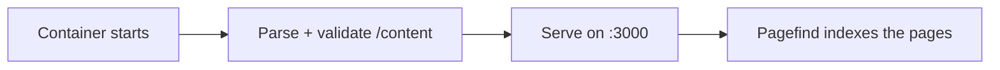

# Déploiement avec Docker

La façon recommandée de lancer open-docs est le conteneur publié. Une
seule image générique sert n'importe quel jeu de documentation ; vous
fournissez le contenu à l'exécution.

```sh
docker run --rm -p 3000:3000 \
  -v ./content:/content:ro \
  -v ./static:/static:ro \
  -e PUBLIC_BRAND_NAME="My Project" \
  -e PUBLIC_SITE_TITLE="My Project Docs" \
  -e PUBLIC_REPO_URL="https://github.com/me/my-project" \
  ghcr.io/manchtools/open-docs:latest
```

Rendez-vous sur `http://localhost:3000`.

## Montages

| Montage | Correspond à | Contient |
|---|---|---|
| `/content` | `src/content/` | Vos fichiers `.md` / `.markdoc` et un `theme.css` optionnel. |
| `/static` | `static/` | Favicons, `og.png`, captures d'écran. Fusionnés par-dessus les valeurs par défaut. |

Les deux montages sont optionnels. Le montage du contenu peut être en
lecture seule (`:ro`) ; l'entrypoint le copie dans l'arborescence de
l'image avant le démarrage du serveur.


Sans montage `/content`, l'image sert la documentation d'open-docs
elle-même, une démo en direct que vous pouvez parcourir avant d'ajouter
votre propre contenu.


## Ce qui se passe au démarrage

Il n'y a pas d'étape de build. Le conteneur analyse et valide votre
Markdown à son démarrage (quelques secondes, environ 100–150 Mo de
mémoire — il tourne confortablement sur un hôte de 256 Mo) et rend les
pages sur le serveur. L'index de recherche est construit quelques
instants après la mise en route du serveur :



La validation est stricte : une balise inconnue, un attribut requis
manquant, un lien interne mort ou une capture d'écran pointant vers un
fichier manquant arrête le conteneur avec une liste fichier-et-ligne,
exactement comme l'ancien build aurait échoué. Corrigez le contenu et
relancez-le.

Comme rien n'est compilé, changer le contenu, l'image de marque
(`PUBLIC_*`), les jetons ou `theme.css` ne demande qu'un redémarrage du
conteneur.

## Déploiements sous un sous-chemin

Pour héberger sous un sous-chemin (par exemple `https://example.com/docs`),
définissez `BASE_PATH` :

```sh
-e BASE_PATH=/docs
```

Tous les liens internes, les ressources et l'index de recherche sont
servis sous ce préfixe. C'est le seul réglage qui reconstruit encore
l'application au démarrage (SvelteKit compile le chemin de base), ce qui
demande environ 1,5 Go de mémoire — sur les petits hôtes, préférez
plutôt retirer le préfixe au niveau de votre reverse proxy.

## Environnement

Chaque variable `PUBLIC_*` est lue au démarrage du conteneur. Voir
[Configuration](/fr/customizing/configuration) pour l'habillage du site et
[Variables d'environnement](/fr/reference/environment-variables) pour la
liste complète.
