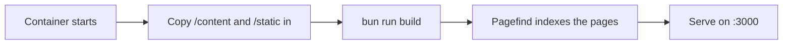

# Déploiement avec Docker

La façon recommandée de lancer open-docs est le conteneur publié. Une
seule image générique sert n'importe quel jeu de documentation ; vous
fournissez le contenu à l'exécution.

```sh
docker run --rm -p 3000:3000 \
  -v ./content:/content:ro \
  -v ./static:/static:ro \
  -e PUBLIC_BRAND_NAME="My Project" \
  -e PUBLIC_SITE_TITLE="My Project Docs" \
  -e PUBLIC_REPO_URL="https://github.com/me/my-project" \
  ghcr.io/manchtools/open-docs:latest
```

Rendez-vous sur `http://localhost:3000`.

## Montages

| Montage | Correspond à | Contient |
|---|---|---|
| `/content` | `src/content/` | Vos fichiers `.md` / `.markdoc` et un `theme.css` optionnel. |
| `/static` | `static/` | Favicons, `og.png`, captures d'écran. Fusionnés par-dessus les valeurs par défaut. |

Les deux montages sont optionnels. Le montage du contenu peut être en
lecture seule (`:ro`) ; l'entrypoint le copie dans l'arborescence de
l'image avant le build.


Sans montage `/content`, l'image sert la documentation d'open-docs
elle-même, une démo en direct que vous pouvez parcourir avant d'ajouter
votre propre contenu.


## Comment un build se déroule

L'image diffère le build du site au démarrage du conteneur, si bien que
la même image publiée fonctionne pour n'importe quel contenu :



Cela ajoute un court build au démarrage, en échange d'une seule image
publiée générique et légère, au lieu d'une image distincte par jeu de
documentation.

## Déploiements sous un sous-chemin

Pour héberger sous un sous-chemin (par exemple `https://example.com/docs`),
définissez `BASE_PATH` :

```sh
-e BASE_PATH=/docs
```

Tous les liens internes, les ressources et l'index de recherche sont
générés avec ce préfixe.

## Environnement

Chaque variable `PUBLIC_*` est intégrée au build. Voir
[Configuration](/fr/customizing/configuration) pour l'habillage du site et
[Variables d'environnement](/fr/reference/environment-variables) pour la
liste complète.
