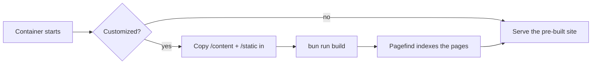

# Déploiement avec Docker

La façon recommandée de lancer open-docs est le conteneur publié. Une
seule image générique sert n'importe quel jeu de documentation ; vous
fournissez le contenu à l'exécution.

```sh
docker run --rm -p 3000:3000 \
  -v ./content:/content:ro \
  -v ./static:/static:ro \
  -e PUBLIC_BRAND_NAME="My Project" \
  -e PUBLIC_SITE_TITLE="My Project Docs" \
  -e PUBLIC_REPO_URL="https://github.com/me/my-project" \
  ghcr.io/manchtools/open-docs:latest
```

Rendez-vous sur `http://localhost:3000`.

## Montages

| Montage | Correspond à | Contient |
|---|---|---|
| `/content` | `src/content/` | Vos fichiers `.md` / `.markdoc` et un `theme.css` optionnel. |
| `/static` | `static/` | Favicons, `og.png`, captures d'écran. Fusionnés par-dessus les valeurs par défaut. |

Les deux montages sont optionnels. Le montage du contenu peut être en
lecture seule (`:ro`) ; l'entrypoint le copie dans l'arborescence de
l'image avant le build.


Sans montage `/content`, l'image sert la documentation d'open-docs
elle-même, une démo en direct que vous pouvez parcourir avant d'ajouter
votre propre contenu.


## Comment un build se déroule

L'image embarque la documentation par défaut **déjà construite**, si bien
qu'un simple `docker run` (sans montage, sans variable d'environnement)
la sert immédiatement en n'utilisant presque pas de mémoire. Elle ne
reconstruit au démarrage que lorsque vous personnalisez — montage de
contenu ou de static, ou variables `PUBLIC_*` / `BASE_PATH` :



Le build est l'étape lourde : il regroupe Vite, Mermaid et Shiki et atteint
environ 2 Go de mémoire, quel que soit le nombre de pages. L'exécuter une
fois lors de la construction de l'image garde un simple `docker run` léger.

Pour servir des documents **personnalisés** sur un hôte à faible mémoire,
intégrez-les dans une petite image sur votre machine de build plutôt que de
reconstruire au démarrage :

```dockerfile
FROM ghcr.io/manchtools/open-docs:latest
COPY ./content/ /app/src/content/
RUN bun run build
```

Lancez cette image sans montage `/content` et elle sert votre site
pré-construit, sans build (ni 2 Go) à l'exécution.

## Déploiements sous un sous-chemin

Pour héberger sous un sous-chemin (par exemple `https://example.com/docs`),
définissez `BASE_PATH` :

```sh
-e BASE_PATH=/docs
```

Tous les liens internes, les ressources et l'index de recherche sont
générés avec ce préfixe.

## Environnement

Chaque variable `PUBLIC_*` est intégrée au build. Voir
[Configuration](/fr/customizing/configuration) pour l'habillage du site et
[Variables d'environnement](/fr/reference/environment-variables) pour la
liste complète.
