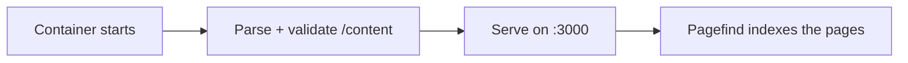

# Deploying with Docker

The recommended way to run open-docs is the published container. One
generic image serves any docset; you provide the content at run time.

```sh
docker run --rm -p 3000:3000 \
  -v ./content:/content:ro \
  -v ./static:/static:ro \
  -e PUBLIC_SITE_URL="https://docs.example.com" \
  -e PUBLIC_BRAND_NAME="My Project" \
  -e PUBLIC_SITE_TITLE="My Project Docs" \
  -e PUBLIC_REPO_URL="https://github.com/me/my-project" \
  ghcr.io/manchtools/open-docs:latest
```

Visit `http://localhost:3000`.


`PUBLIC_SITE_URL` is the full public base URL of your site (for example
`https://docs.example.com`). Set it on **every** deployment. Without it,
canonical links, `sitemap.xml`, `robots.txt`, `llms.txt`, and the blog
**Atom feeds** all fall back to relative URLs, which search engines and
feed importers (dev.to, Medium) can't resolve; the server logs a warning
at start. It's read at runtime, so setting it never triggers a rebuild.


## Docker Compose

The same configuration as a `compose.yaml`. Keep `PUBLIC_SITE_URL` at the
top of `environment:` so it's never dropped:

```yaml
services:
  docs:
    image: ghcr.io/manchtools/open-docs:latest
    ports:
      - "3000:3000"
    environment:
      # REQUIRED in production — your site's full public base URL.
      # Turns on absolute canonical links, sitemap.xml, robots.txt,
      # llms.txt, and syndication-ready Atom feeds. Leave it out and all
      # of those emit relative URLs (the server warns at start).
      PUBLIC_SITE_URL: "https://docs.example.com"
      PUBLIC_BRAND_NAME: "My Project"
      PUBLIC_SITE_TITLE: "My Project Docs"
      PUBLIC_REPO_URL: "https://github.com/me/my-project"
    volumes:
      - ./content:/content:ro
      - ./static:/static:ro
    restart: unless-stopped
```

Start it with `docker compose up -d`.

## Mounts

| Mount | Maps to | Holds |
|---|---|---|
| `/content` | `src/content/` | Your `.md` / `.markdoc` files and optional `theme.css`. |
| `/static` | `static/` | Favicons, `og.png`, screenshots. Merged over the defaults. |

Both mounts are optional. The content mount can be read-only (`:ro`);
the entrypoint copies it into the image tree before the server starts.


With no `/content` mount, the image serves the open-docs documentation
itself, a live demo you can click through before adding your own
content.


## What happens at start

There is no build step. The container parses and validates your Markdown
when it starts (a couple of seconds, roughly 100–150 MB of memory — it
runs comfortably on a 256 MB host) and renders pages on the server. The
search index is built moments after the server is up:



Validation is strict: an unknown tag, a missing required attribute, a
dead internal link, or a screenshot pointing at a missing file stops the
container with a file-and-line listing, the same way the old build would
have failed. Fix the content and start it again.

Because nothing is compiled, changing content, branding (`PUBLIC_*`),
tokens, or `theme.css` only needs a container restart.

## Sub-path deploys

To host under a sub-path (for example `https://example.com/docs`), set
`BASE_PATH`:

```sh
-e BASE_PATH=/docs
```

All internal links, assets, and the search index are served under that
prefix. This is the one setting that still rebuilds the app at start
(SvelteKit compiles the base path in), which needs about 1.5 GB of
memory — on small hosts, prefer stripping the prefix at your reverse
proxy instead.

## Environment

Every `PUBLIC_*` variable is read when the container starts. See
[Configuration](/customizing/configuration) for site chrome and
[Environment variables](/reference/environment-variables) for the
complete list.
